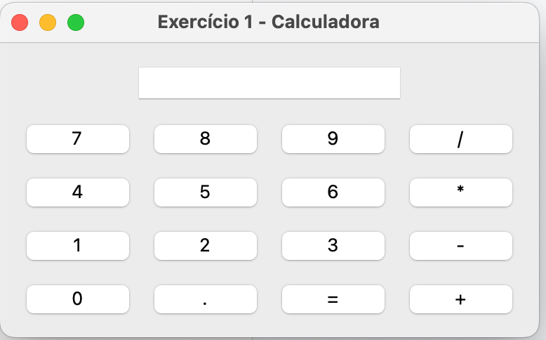
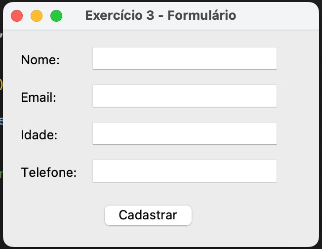
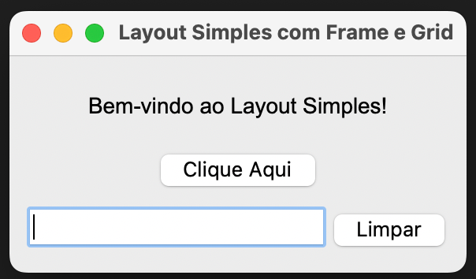

# AULA 9
[Interface Tkinter]

1. Crie uma calculadora parecida, com o seguinte Layout:

2. Crie um formulário parecido, com o seguinte layout:

3. Crie um formulário parecido, com o seguinte layout:
