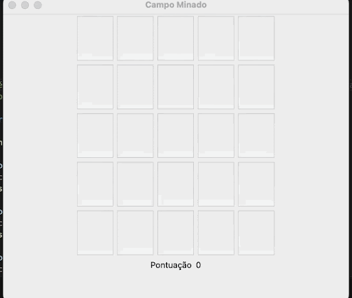

# Aula 14

1. Você deve criar um campo minado, com as seguintes configurações:

- Tamanho da janela 540x450
- Quantidade de Linhas 5 e quantidade de colunas 5, totalizando 25 botões
- Deve possuir 5 bombas aleatórias
- Se clicar em um campo que Não possui bomba, deve apresentar o texto 1 - no botão e somar a pontuação
- Se clicar em um campo que possui a bomba, deve apresentar a mensagem 
    - Bomba encontrada!!!! Deseja reiniciar o Jogo?
    - Se sim, reinicia o jogo
    - Senão, fecha a janela

Segue exemplo:

